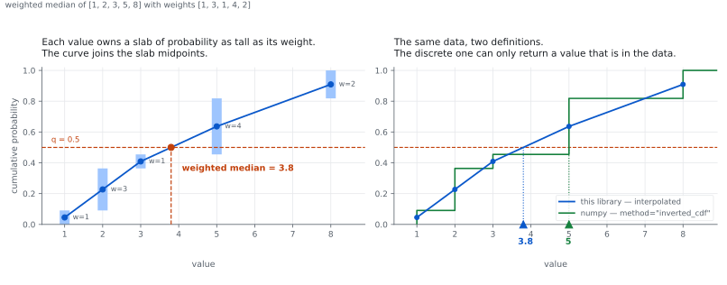

wquantiles
==========

[](https://github.com/nudomarinero/wquantiles/actions/workflows/tests.yml)
[](http://dx.doi.org/10.5281/zenodo.14952)
[](https://pypi.python.org/pypi/wquantiles)

Weighted quantiles with Python, including the weighted median. numpy is the
only dependency.

```bash
pip install wquantiles
```

```python
>>> import numpy as np
>>> import wquantiles

>>> data = np.array([1, 2, 3, 5, 8])
>>> weights = np.array([1, 3, 1, 4, 2])

>>> wquantiles.median(data, weights)
3.8
>>> wquantiles.quantile(data, weights, 0.25)
2.125
```

`quantile` takes the data, a one-dimensional array of weights, and the
quantile to compute, between 0 and 1. For multi-dimensional data the weights
apply along the last axis, and the weights must match that axis. `median` is
an alias for `quantile(data, weights, 0.5)`. `nanquantile` and `nanmedian` are
the same but treat `NaN` as missing data rather than propagating it, as
`np.nanquantile` does.

How it works
------------



Each distinct value owns a slab of probability as tall as its total weight.
The slab midpoints give a weighted cumulative distribution,

    Pn = (Sn - 0.5 * w) / Sn[-1]        with Sn the cumulative weights

and the result is read off by linear interpolation. The `- 0.5 * w` is what
puts each node at the *middle* of its slab rather than at the top, which is
the left panel of the figure.

With equal weights and no repeated values this is exactly numpy's
`method="hazen"` (Hyndman–Fan type 5).

How this relates to `numpy.quantile`
------------------------------------

Since numpy 2.0, `np.quantile` accepts weights — but only with
`method="inverted_cdf"`, which is **discrete**: it returns a value that is
actually in the data and never interpolates. There is still no weighted
equivalent of `method="linear"` or `"hazen"` anywhere in numpy, which is what
this library provides.

| data | weights | q | `wquantiles` | `np.quantile(inverted_cdf)` |
|---|---|---|---|---|
| `[1, 2, 3]` | `[100, 1, 1]` | 0.50 | 1.0198 | 1 |
| `[1, 2, 3]` | `[100, 1, 1]` | 0.75 | 1.5248 | 1 |
| `[1, 2, 3, 5, 8]` | `[1, 3, 1, 4, 2]` | 0.50 | 3.8 | 5 |
| `[1, 2, 3, 5, 8]` | `[1, 3, 1, 4, 2]` | 0.75 | 6.25 | 5 |
| `[10, 25, 30, 35, 50]` | `[1, 1, 4, 2, 1]` | 0.25 | 26.5 | 30 |

**Use numpy** if you want the discrete definition — a weighted median that is
one of your data points.

**Use this library** if the weights describe a sampled continuous quantity and
you want the quantile of the distribution they imply. That is the usual case
when weights come from measurement uncertainties, exposure times, areas, or
population counts.

`statsmodels.stats.weightstats.DescrStatsW.quantile` is a third option, which
follows the SAS definition — different again, and a much heavier dependency.

### Why the answer can surprise you

This was [issue #4](https://github.com/nudomarinero/wquantiles/issues/4):

```python
>>> wquantiles.median(np.array([1, 2, 3]), np.array([100, 1, 1]))
1.0198019801980198
```

Nearly all the weight is on `1`, so the median sits just above it — but not
*at* it. Under the distributional reading the value `1` occupies the
probability range 0 to 100/102, and its node sits in the middle of that range,
at 50/102. The median at q=0.5 is fractionally past that node, so the curve
has begun to climb towards `2`. If you want `1.0` here, you want the discrete
definition, and numpy will give it to you.

Missing data, masks and repeated values
---------------------------------------

- The weights of **equal values** are summed, so each distinct value
  contributes a single node carrying all of its mass.
- A value whose weight is **zero** owns no probability mass and is dropped
  before interpolating.
- Entries masked out of a `numpy.ma.MaskedArray` are dropped as well, whether
  the mask is on the data or on the weights.
- `NaN` in the data or the weights **propagates**, as it does in
  `np.quantile`. Use `nanquantile` / `nanmedian` to drop it instead.
- If nothing is left to average over — empty input, all weights zero,
  everything masked — the result is `NaN` and a `RuntimeWarning` is raised.
- Negative weights raise `ValueError`: they push `Pn` outside `[0, 1]`, so the
  curve being interpolated stops being a cumulative distribution. Infinite
  weights raise too, because the limit is not unique — for data `[1, 2, 3]`
  with weights `[1, W, 1]`, letting `W → ∞` gives `1.5` at q=0.25 but `2.0` at
  q=0.5.

Behaviour changes in 0.7
------------------------

Two changes alter results for input that was always accepted. Both are cases
where the old answer depended on an accident of the implementation. If you
need the old numbers, pin `wquantiles==0.6`.

### Repeated values

**Up to 0.6, two equal values carried two separate nodes**, so the answer could
depend on the order you happened to store them in:

```python
>>> quantile_1D([1, 2, 2, 3], [1, 5, 0.5, 1], 0.2)
1.333    # 0.6, as written
2.000    # 0.6, with the two 2s swapped
1.308    # 0.7, either way
```

The weights of equal values are now summed, so the estimator is a function of
the weighted distribution — `[1,2,2,3]` with unit weights and `[1,2,3]` with
weights `[1,2,1]` are the same sample written two ways, and now agree. numpy's
weighted `inverted_cdf` and statsmodels both already behaved this way.

The cost is that the numpy `hazen` equivalence now holds only for **distinct**
values. That is the deliberate trade: `hazen` is defined on order statistics,
which split a tie across two plotting positions, but the plotting-position
family was derived for continuous distributions where ties have probability
zero — it has no considered position on repeated values.

Continuous data is untouched; around 40% of unit-weight cases on integer or
binned data move.

### Zero weights

**Up to 0.6, a value with zero weight still acted as a node** and could be
returned as the answer even though it counted for nothing:

```python
>>> quantile_1D([1, 1.5, 3], [1, 0, 1], 0.5)
1.5      # 0.6: the zero-weight point itself
2.0      # 0.7: that point is dropped first
```

This changes results only when some weight is exactly zero; roughly 20% of such
cases move. A zero weight now means the same thing as a mask: this value does
not count.

Results for data with **distinct values and all-positive weights** are
bit-identical to 0.6, verified over tens of thousands of comparisons.

Development
-----------

```bash
uv sync                      # set up
uv run pytest                # test
uv run --group docs python docs/make_figure.py   # regenerate the figure
```
